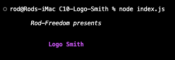
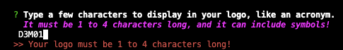
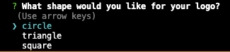
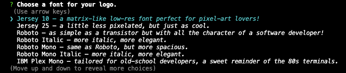
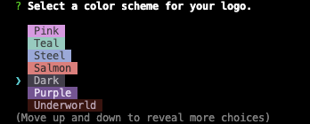
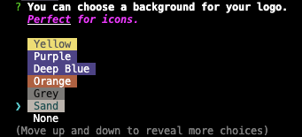
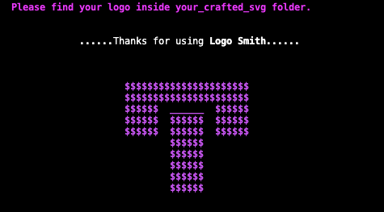
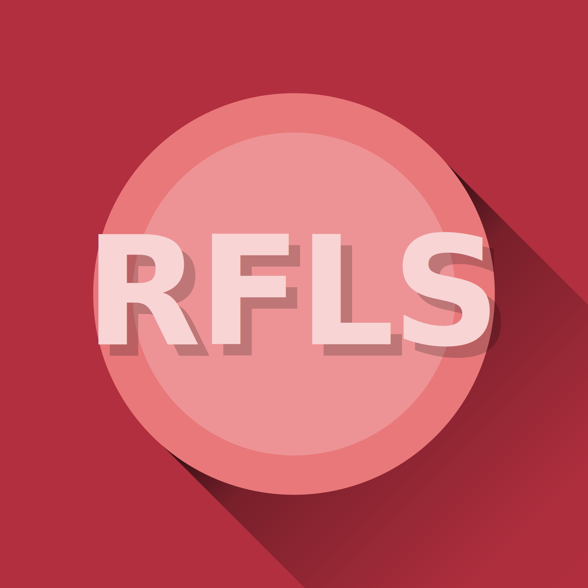
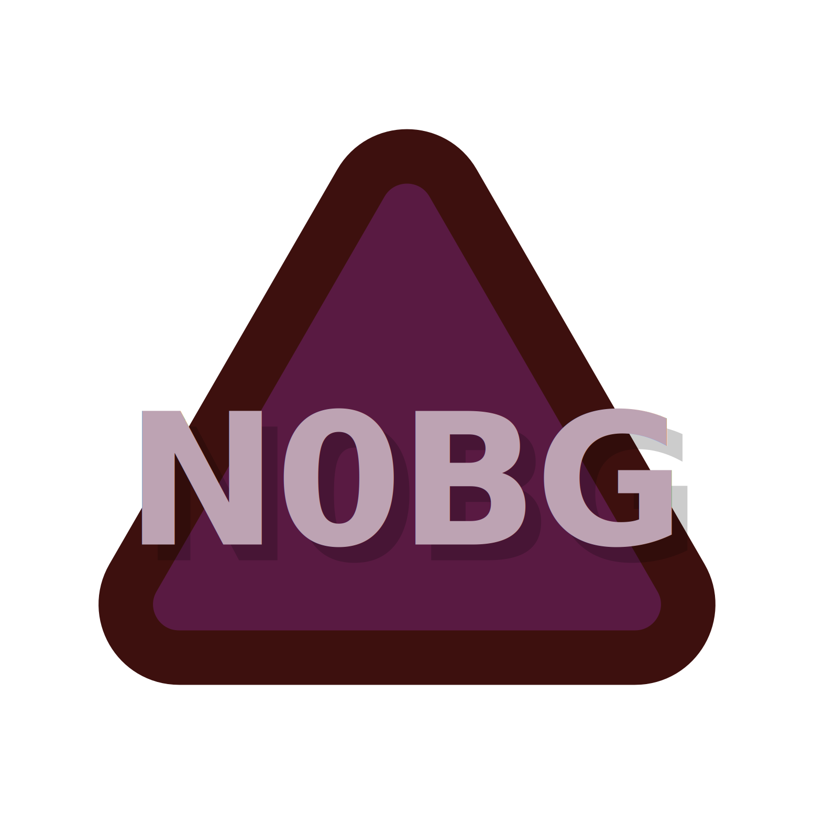

<p align="center">
  
</p>

<h1 align="center">Logo Smith</h3>

<p align="center"><i>Craft your logo as if forged by the grand craftsmen Brokkr and Eitri!</i></p>

<p align="center">
  <a href="https://github.com/Rod-Freedom/C10-Logo-Smith/blob/main/LICENSE"></a>
</p>

<br>
<br>

## **ABOUT THE PROJECT**
### **Overview**
Craft Your Logo with Legendary Precision.

Logo Smith, a Node.js app, empowers you to create impactful logos effortlessly. Customize easily, iterate in an instant, and export flawlessly. Start forging your logo today!

The process will take you less than a minute, and you'll have a careful selection of fonts and color schemes at your disposal. You'll also have the option of adding a tasteful background for your logo, perfect for favicons and profile pics.

*Find the repo [here](https://github.com/Rod-Freedom/C10-Logo-Smith).*<br>
*Watch our tutorial [here](https://youtu.be/SatStJGm9Fk?feature=shared)!*

<br>
<br>

## Table of Contents
- [License](#license)
- [Resources](#resources)
- [Get Started](#get-started)
- [Usage](#usage)
- [Demos](#demos)
- [Contribute](#contribute)
- [Credits](#credits)

<br>

[(Back to the Top)](#about-the-project)

## Resources
* For Node:
    * `fs` methods.
      * `fs.writeFile` to create the SVG.
      * `fs.existsSync` to look for folders.
      * `fs.mkdirSync` to create folders.
    * `import from` as modules.
    * `"type": "module"` for exports.
    * `export default` for classes.
    * `export` for functions.
    * `process.stdout` methods to manipulate the console.
* `npm` packages:
    * Inquirer for prompting.
    * Chalk for logs' format.
    * Chalk Animation to animate text in the terminal.
    * Nanospinner for waiting.
    * Jest for testing.
      * `describe()` and `it()` thoroughly applied for organized testing.
* For JavaScript
    * Promises.
    * Object and array destructuring.
    * Polymorphism for methods.
    * Classes and constructors.
    * `throw new Error` to stop faulty executions.
    * `setTimeout` executions for UX.

<br>

[(Back to the Top)](#about-the-project)

## Get Started
*Watch our tutorial [here](https://youtu.be/SatStJGm9Fk?feature=shared)!*

Once you have the repo on your computer after running `git clone`, open your command line. Make sure to open the Logo Smith repo folder in your terminal. Use `npm i` to install all the modules needed to run the Smith.

First clone:
```bash
$ git clone https://github.com/Rod-Freedom/C10-Logo-Smith.git
```
Then install the modules:
```bash
$ npm i
```

<br>

[(Back to the Top)](#about-the-project)

## Usage
*Watch our tutorial [**here**](https://youtu.be/SatStJGm9Fk?feature=shared)!*

**Logo Smith** is easy and intuitive to use. To run it, open the Logo Smith folder in your terminal, then type `node index.js` or `npm start` and hit `enter`.
```bash
$ node index.js
```

<br>
<br>

You'll then see the intro with a pulse animation.

> 

<br>
<br>

Next, the Smith will ask you for a text to display on your logo. Think of an acronym for it, 4 characters max, or maybe just a single character/number/symbol.

> 

<br>
<br>

Then, you'll choose between circle, triangle and square as your logo shape.

> 

<br>
<br>

Choose a font! They're all cool as hell!
> 

<br>
<br>

Most importantly, choose the color scheme.
> 

<br>
<br>

Finally, you may choose a background for your logo. It's optional, but it's perfect for favicons and profile pics!
> 

<br>
<br>

Once you're done, you'll find your new SVG inside the *your_crafted_svg* folder.
> 

<br>

[(Back to the Top)](#about-the-project)

## Demos
You have a ton of options to customize your logo.

You may use any shape, font or color you like!




One example without background, perfect for a header.


<br>

[(Back to the Top)](#about-the-project)

## License
<br>
See the [license](https://github.com/Rod-Freedom/C10-Logo-Smith/blob/main/LICENSE) for more details.

<br>

[(Back to the Top)](#about-the-project)

## Contribute
If you have suggestions or want to help with some improvements, you can write me by [email](mailto:rod@alpacaazul.mx).

<br>

[(Back to the Top)](#about-the-project)

## Credits
All the code was created from scratch by [Rod's Freedom](https://github.com/Rod-Freedom) (with the help of the `npm` packages mentioned [above](#resources)).

<br>

[(Back to the Top)](#about-the-project)
